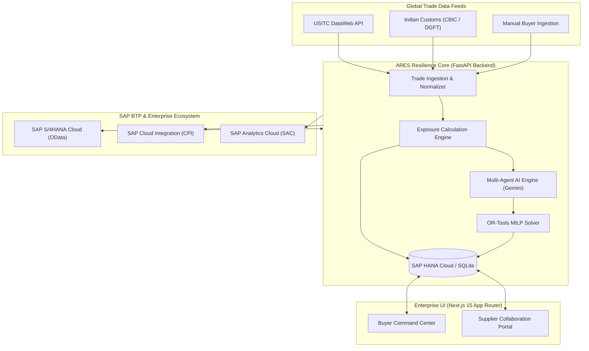

# ARES: Autonomous Resilience & Enterprise Supply Chain

[](https://fastapi.tiangolo.com)
[](https://nextjs.org/)
[](https://www.typescriptlang.org/)
[](https://www.python.org/)
[](https://www.sap.com/products/technology-platform.html)
[](https://www.sap.com/products/technology-platform/hana.html)
[](https://ai.google.dev/)
[](https://opensource.org/licenses/MIT)

> **ARES** is an enterprise-grade, autonomous supply chain resilience platform built on **SAP Business Technology Platform (BTP)**, **SAP HANA Cloud**, **FastAPI**, and **Next.js**. It ingests global trade disruption events (tariffs, geopolitical shifts, customs changes from USITC & DGFT/CBIC), computes true enterprise exposure, coordinates supplier impact confirmations, generates multi-agent mitigation strategies, and optimizes rerouting using deterministic mixed-integer linear programming (Google OR-Tools).

---

## 📑 Table of Contents

- [Key Capabilities](#-key-capabilities)
- [System Architecture](#-system-architecture)
- [End-to-End Workflow](#-end-to-end-workflow)
- [Tech Stack](#-tech-stack)
- [Repository Structure](#-repository-structure)
- [Getting Started](#-getting-started)
  - [Prerequisites](#prerequisites)
  - [Backend Setup](#1-backend-setup-fastapi)
  - [Frontend Setup](#2-frontend-setup-nextjs)
  - [Docker Compose Alternative](#3-docker-compose-environment)
- [Configuration & Environment Variables](#-configuration--environment-variables)
- [SAP Ecosystem & Integrations](#-sap-ecosystem--integrations)
- [Automated Testing](#-automated-testing)
- [Deployment on SAP BTP Cloud Foundry](#-deployment-on-sap-btp-cloud-foundry)
- [Contributing & Security](#-contributing--security)
- [License](#-license)

---

## ⚡ Key Capabilities

1. **Autonomous Trade & Tariff Ingestion**
   - Direct integration with **USITC DataWeb API** and Indian trade authorities (**CBIC / ICEGATE / DGFT**).
   - Automated Harmonized System (HS) code matching with strict/broad regex normalization.

2. **Autonomous Multi-Agent AI Engine (Powered by Google Gemini)**
   - Specialized agents: *Supplier Intelligence*, *Inventory Allocation*, *Logistics & Rerouting*, and *Financial Risk Modeling*.
   - Dynamic simulation generation and proactive risk scoring.

3. **Deterministic Mathematical Optimization (Google OR-Tools)**
   - Mixed-Integer Linear Programming (MILP) solving supply allocations, multi-tier capacity bounds, minimum order quantities (MOQ), and shipping lead times while minimizing landed costs and carbon footprints.

4. **Supplier Self-Service & Negotiations Portal**
   - Independent supplier portal with organization-level isolation and Row-Level Security (RLS).
   - Multi-stage onboarding (`REGISTERED → PENDING_VERIFICATION → ACTIVE`), production capacity updates, counter-offers, and real-time disruption acknowledgment.

5. **Deep SAP Ecosystem Synchronizations**
   - **SAP HANA Cloud**: Enterprise data tier supporting HDI containers, connection pooling, and Cloud Foundry service bindings.
   - **SAP S/4HANA Cloud (OData)**: Live sync of Purchase Orders (`A_PurchaseOrder`), Business Partners (`A_BusinessPartner`), and Material Documents (`A_MaterialDocument2`).
   - **SAP Cloud Integration (CPI)**: Outbound event dispatch for confirmed trade exposures.
   - **SAP Analytics Cloud (SAC)**: Executive dashboards and scenario analysis feeds.

---

## 🏛 System Architecture



---

## 🔄 End-to-End Workflow

```
Supplier Registration ──▶ Buyer Approval ──▶ Supply Network Map
                                                     │
                                                     ▼
Human Scenario Approval ◀── Deterministic MILP ◀── AI Agent Engine ◀── Trade/Tariff Event
           │
           ▼
Simulation & PO Sync to SAP S/4HANA & Analytics Cloud
```

---

## 🛠 Tech Stack

| Layer | Technologies |
| :--- | :--- |
| **Frontend** | Next.js 15 (App Router), React 19, TypeScript, Tailwind CSS, Lucide Icons, Framer Motion |
| **Backend** | Python 3.11+, FastAPI, SQLAlchemy, Pydantic v2, Alembic, Uvicorn |
| **Database** | SAP HANA Cloud (`hdbcli` / `sqlalchemy-hana`), SQLite (Local dev), PostgreSQL |
| **AI & LLM** | Google Gemini Generative AI, LangGraph Multi-Agent Workflows |
| **Optimization** | Google OR-Tools (Mixed-Integer Linear Programming) |
| **SAP BTP Integration** | SAP Business Accelerator Hub, Cloud Integration (CPI), SAP Analytics Cloud (SAC) |
| **Testing & CI** | Pytest, Pytest-Asyncio, HTTPX, Docker, Cloud Foundry CLI (`cf`) |

---

## 📂 Repository Structure

```
.
├── backend/                        # FastAPI Backend Application
│   ├── alembic/                    # Database migration scripts
│   ├── app/
│   │   ├── routers/                # API Endpoints (analytics, auth, trade, scenarios, suppliers)
│   │   ├── services/               # Core AI, SAP Adapter, Trade Adapter, OR-Tools Optimizer
│   │   ├── tests/                  # Pytest test suite
│   │   ├── auth.py                 # JWT & RBAC security utilities
│   │   ├── config.py               # Settings & SAP Cloud Foundry VCAP_SERVICES parser
│   │   ├── database.py             # Engine initialization & connection pooling
│   │   ├── models.py               # SQLAlchemy enterprise schema
│   │   └── schemas.py              # Pydantic validation models
│   ├── .env.example                # Backend environment template
│   ├── Dockerfile                  # Container definition
│   ├── requirements.txt            # Python dependencies
│   └── startup.py                  # Cloud Foundry DB initialization bootstrapper
│
├── frontend/                       # Next.js Frontend Application
│   ├── public/                     # Static assets & ARES vector branding
│   ├── src/
│   │   ├── app/                    # App Router pages (/, /buyer, /supplier, /login)
│   │   ├── components/             # Reusable UI & landing page sections
│   │   └── lib/                    # API client and utility helpers
│   ├── .env.example                # Frontend environment template
│   ├── Dockerfile                  # Container definition
│   └── package.json                # NPM dependencies & scripts
│
├── sap_artifacts/                  # SAP Cloud Integration (CPI) integration flow packages
├── ARES_Master_SRD_v4.0_Complete.md# Master System Requirements Document (SRD)
├── architecture_overview.md        # Technical architecture specifications
├── sap_integration_guide.md        # Step-by-step SAP BTP & S/4HANA connection manual
├── docker-compose.yml              # Local multi-service infrastructure
├── manifest.yml                    # SAP BTP Cloud Foundry deployment manifest
└── README.md                       # Main project documentation
```

---

## 🚀 Getting Started

### Prerequisites

- **Python 3.11+** installed
- **Node.js 18+** & **npm** installed
- *(Optional)* **Docker & Docker Compose** for containerized execution
- *(Optional)* **Cloud Foundry CLI (`cf`)** for deploying to SAP BTP

---

### 1. Backend Setup (FastAPI)

```bash
# Navigate to the backend directory
cd backend

# Create and activate a Python virtual environment
# On Linux / macOS:
python3 -m venv venv
source venv/bin/activate
# On Windows:
python -m venv venv
.\venv\Scripts\activate

# Install dependencies
pip install -r requirements.txt

# Configure environment variables
cp .env.example .env

# Run the FastAPI development server
uvicorn app.main:app --host 0.0.0.0 --port 8000 --reload
```

- API Interactive Swagger UI: [http://localhost:8000/docs](http://localhost:8000/docs)
- API Health Endpoint: [http://localhost:8000/health](http://localhost:8000/health)

---

### 2. Frontend Setup (Next.js)

```bash
# Open a new terminal and navigate to the frontend directory
cd frontend

# Install dependencies
npm install

# Configure environment variables
cp .env.example .env.local

# Start the Next.js development server
npm run dev
```

- Web Application: [http://localhost:3000](http://localhost:3000)
- Buyer Dashboard: [http://localhost:3000/buyer](http://localhost:3000/buyer)
- Supplier Portal: [http://localhost:3000/supplier](http://localhost:3000/supplier)

---

### 3. Docker Compose Environment

To launch the backend and auxiliary services using Docker Compose:

```bash
docker-compose up --build
```

---

## ⚙ Configuration & Environment Variables

### Backend Configuration (`backend/.env`)

| Variable | Description | Default / Example |
| :--- | :--- | :--- |
| `DATABASE_URL` | SQLAlchemy connection string | `sqlite:///./ares.db` or `hana+hdbcli://...` |
| `JWT_SECRET` | Secret key for signing authentication tokens | `your_secret_key` |
| `GEMINI_API_KEY` | Google Gemini API key for AI engine | `AIzaSy...` |
| `USITC_API_KEY` | USITC DataWeb API authentication token | `eyJhbGci...` |
| `SAP_API_KEY` | SAP Business Accelerator Hub API key | `sandbox_api_key` |
| `SAP_HUB_BASE_URL` | S/4HANA Cloud OData sandbox or production URL | `https://sandbox.api.sap.com/s4hanacloud/...` |
| `SAP_INTEGRATION_URL`| SAP Cloud Integration (CPI) webhook endpoint | `https://<tenant>.hana.ondemand.com/...` |
| `SAP_ANALYTICS_URL` | SAP Analytics Cloud REST API endpoint | `https://<tenant>.hcs.cloud.sap/...` |
| `USE_MOCK_SAP` | Set to `true` for offline demo mode | `false` |

### Frontend Configuration (`frontend/.env.local`)

| Variable | Description | Default / Example |
| :--- | :--- | :--- |
| `NEXT_PUBLIC_API_URL` | Backend URL for API calls | `http://localhost:8000` |
| `PORT` | Local web port | `3000` |

---

## 🔗 SAP Ecosystem & Integrations

For complete setup guides on SAP services, refer to [sap_integration_guide.md](./sap_integration_guide.md):

- **SAP HANA Cloud**: Automated connection string discovery via `VCAP_SERVICES` binding in `backend/app/config.py` and `backend/startup.py`.
- **SAP S/4HANA Cloud**: Bidirectional sync for Purchase Orders (`A_PurchaseOrder`), Supplier Master Data (`A_BusinessPartner`), and Material Inventory.
- **SAP Cloud Integration (CPI)**: Real-time webhook pipelines for customs trade alerts.
- **SAP Analytics Cloud (SAC)**: Pushes risk-adjusted scenario simulations into executive analytics stories.

---

## 🧪 Automated Testing

Run the automated test suite with Pytest:

```bash
cd backend
pytest app/tests/ -v
```

### Test Coverage Highlights:
- `test_ares.py`: End-to-end API scenario testing, supplier negotiations, and optimization routines.
- `test_usitc_adapter.py`: Live and fallback testing for trade data ingestion and HS code normalization.
- `test_security_fixes.py`: RBAC validation, tenant isolation, and SQL injection protection.
- `test_database_pooling.py`: Connection pool durability and concurrent query handling.

---

## ☁ Deployment on SAP BTP Cloud Foundry

1. **Log in to SAP Cloud Foundry**:
   ```bash
   cf login -a https://api.cf.<region>.hana.ondemand.com -u <user> -o <org> -s <space>
   ```

2. **Deploy using the pre-configured manifest**:
   ```bash
   cf push
   ```
   *The `manifest.yml` script will automatically trigger `startup.py` to initialize HANA tables and launch both frontend and backend microservices.*

---

## 🛡 Contributing & Security

1. Ensure sensitive environment variables (`.env`) are never committed to version control.
2. Follow standard pull request workflows:
   - Branch off `main` (`feature/your-feature-name`).
   - Run tests (`pytest`) and linting before submitting PRs.
   - Provide a clear summary of changes in the PR description.

---

## 📄 License

This project is licensed under the [MIT License](LICENSE).
